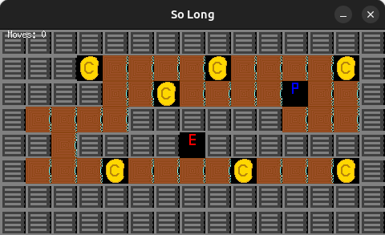
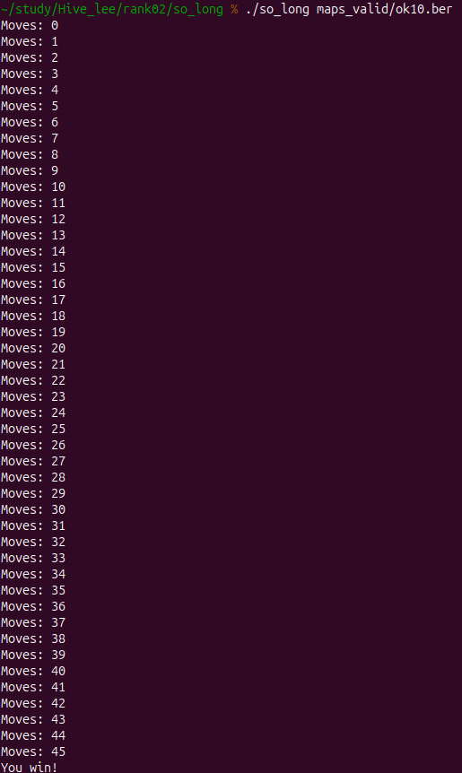

# so_long

A simple 2D game where the player navigates a map, collects all items, and reaches the exit.

  


## Features
- Load and validate `.ber` map files (rectangular, surrounded by walls, contains one player, at least one exit and collectible)  
- Render map using MiniLibX with distinct images for floor, walls, player, collectibles, and exit  
- Handle keyboard input (W/A/S/D or arrow keys) to move the player  
- Count and display move steps in the console  
- Exit game on success (all collectibles gathered and exit reached) or on window close  

## Usage
```sh
./so_long path/to/map.ber
```
- map.ber: text file describing the map layout
  - 1 = wall
  - 0 = floor
  - P = player start
  - C = collectible
  - E = exit

## How It Works
- Parse & Validate: Read the .ber file into a 2D array, check shape and required elements.
- Initialize MLX: Call mlx_init(), create a window sized to tile_size × map_dimensions.
- Load Textures: Load XPM images for each tile type.
- Render Loop: Draw the map by iterating over the array and placing the correct image at each coordinate.
- Input Handling: Set mlx_key_hook to capture movement keys, update player position if the target tile isn’t a wall.
- Picking up a collectible removes it from the map and increments the count.
- If all collectibles are collected and the player steps on the exit, the game ends successfully.
- Move Counter: After each valid move, print the current move count to the console.
- Cleanup: Free all allocated memory, destroy images and window before exiting.
